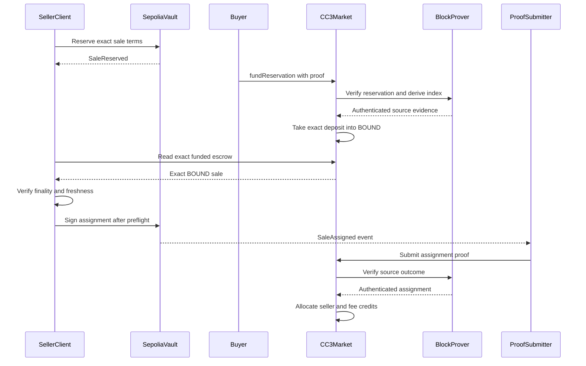
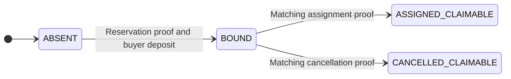
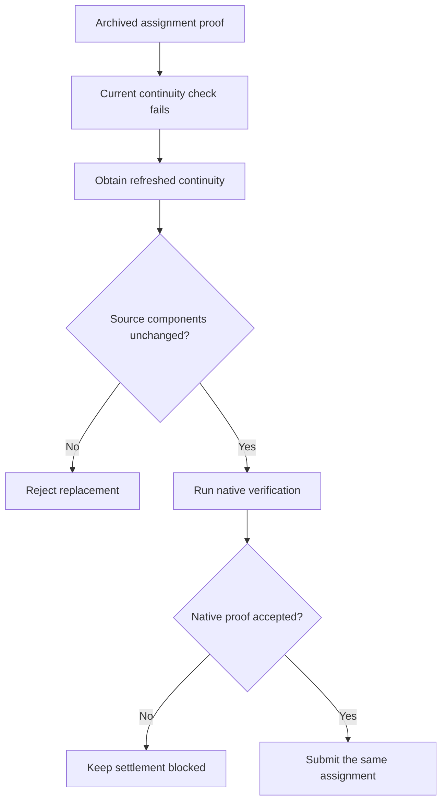

<div align="center">

# Morrow

### Sell a locked payout before it unlocks.

[](https://github.com/Enoch208/morrow/actions/workflows/ci.yml)
[](evidence/local/backend-check-1789308979675.json)
[](evidence/blobs/954be668fd213574fb3790563b6c02d684a79f309bb761029354ea8aa362cbd0.json)
[](evidence/local/mutations-1789292743489.json)
[](#deployments)

Morrow is a cross-chain market for **already-funded, fixed-maturity payouts**. A recipient sells their right to a future payment on Sepolia to a buyer who pays on Creditcoin. The backing stays on Sepolia. The purchase capital stays on Creditcoin. Native Attestcoin proofs connect the two.

**Reserve first. Fund second. Settle from the proven outcome.**

[Watch the demo](#watch-the-demo) · [Live app](https://morrow-inky.vercel.app) · [Proof Room](https://morrow-inky.vercel.app/dashboard/evidence) · [Verify it yourself](#verify-it-yourself)

**DeFi — secondary liquidity for time-locked payments.**

Sepolia → Creditcoin CC3 testnet · Solidity · TypeScript · Native Attestcoin verification

</div>

> **Testnet prototype, not a production financial product.** Morrow uses its own reference escrow and valueless test tokens. Campaign wallets are team-operated. The source contract cannot verify remote funding; seller protection depends on the official client's preflight, which a manual signer can bypass.

## Watch the demo

A narrated walkthrough of the actual application and recorded testnet campaign, including delayed-proof settlement, cancellation, and the Proof Room.

https://github.com/user-attachments/assets/3a40e29c-891c-405f-8d1f-b2c424946862

The walkthrough follows a completed, team-operated campaign; it does not represent a new trade. It starts with the locked-payment problem, follows Claim A's sale and delayed settlement, then shows cancellation, repeated rounds and a read-only proof replay. Explorer links and the independent checker provide the underlying evidence.

### Explore without a wallet

| Open                                                            | Look for                                                    | What it establishes                                                               |
| --------------------------------------------------------------- | ----------------------------------------------------------- | --------------------------------------------------------------------------------- |
| [Dashboard](https://morrow-inky.vercel.app/dashboard)           | Four campaign claims and per-chain accounting               | Where the recorded campaign ended, alongside available live reads                 |
| [Claim A](https://morrow-inky.vercel.app/dashboard/claims/a)    | Reservation, funding, assignment, settlement and redemption | A complete sale; source assignment and destination settlement are separate events |
| [Claim B](https://morrow-inky.vercel.app/dashboard/claims/b)    | Source cancellation and buyer refund                        | The alternative terminal outcome, with no sale fee                                |
| [Claim C](https://morrow-inky.vercel.app/dashboard/claims/c)    | Cancelled first round and assigned second round             | A new round has a new sale identity                                               |
| [Proof Room](https://morrow-inky.vercel.app/dashboard/evidence) | Same proof bytes, native acceptance, `SaleIdMismatch`       | Authenticity alone does not authorize the requested sale                          |

The Proof Room's replay is a read-only `eth_call` at a recorded block. It does not sign or submit a transaction. If an RPC cannot supply the necessary data, the interface reports the limitation rather than manufacturing a pass.

## Contents

- [Why Morrow exists](#why-morrow-exists)
- [Start with the evidence](#start-with-the-evidence)
- [How it works](#how-it-works)
- [Why Attestcoin is load-bearing](#why-attestcoin-is-load-bearing)
- [Security properties](#security-properties)
- [Seller preflight and the SDK](#seller-preflight-and-the-sdk)
- [Contract interface](#contract-interface)
- [Live testnet evidence](#live-testnet-evidence)
- [Verify it yourself](#verify-it-yourself)
- [What is implemented](#what-is-implemented)
- [Deployments](#deployments)
- [Run locally](#run-locally)
- [Engineering decisions](#engineering-decisions)
- [Repository map](#repository-map)
- [Trust boundaries and limitations](#trust-boundaries-and-limitations)
- [Further reading](#further-reading)

## Why Morrow exists

A payout can be fully funded and still unavailable to its recipient until a future date. Morrow lets that recipient sell the payout before maturity, without asking the payer to release it early or moving the backing to another chain.

| Role   | Provides                                         | Receives                                                        |
| ------ | ------------------------------------------------ | --------------------------------------------------------------- |
| Payer  | The full payout, deposited into the source vault | An on-chain record of the funded, scheduled payout              |
| Seller | Their right to the payout                        | Purchase proceeds on Creditcoin, net of the sale fee            |
| Buyer  | The agreed purchase price on Creditcoin          | Beneficiary rights to the source payout, redeemable at maturity |

This is a **sale of a funded claim**, not an unsecured loan, a token bridge or a promise to collect an off-chain invoice. External payroll, vesting and payout adapters are not implemented.

The initial use-case hypothesis is scheduled grant tranches, contributor payouts and similar entitlements whose principal is already deposited and whose remaining condition is time. A payment that is unfunded, discretionary or still subject to payer clawback is outside this implementation.

**Why two chains?** A recipient's claim and a buyer's liquidity may already exist on different networks. Morrow separates their locations: the claim remains backed on Sepolia while the purchase settles on Creditcoin. This is an architectural capability, not evidence that buyers prefer it to a same-chain market. There are no claimed customers, committed external liquidity or production integrations.

## Start with the evidence

The committed verification report dated **13 September 2026, 14:17 UTC** records **26 PASS, 0 FAIL, 0 UNVERIFIED**. It covers the deployed contracts and recorded campaign—not an audit or every possible execution.

| Evidence                                                                                                                | What to inspect                                                 |
| ----------------------------------------------------------------------------------------------------------------------- | --------------------------------------------------------------- |
| [Independent verification report](evidence/blobs/954be668fd213574fb3790563b6c02d684a79f309bb761029354ea8aa362cbd0.json) | Each check's status, evidence label, raw observations and scope |
| [Claims ledger](docs/CLAIMS_LEDGER.md)                                                                                  | Assignment, cancellation, withdrawals, redemption and refusals  |
| [Pinned release candidate](evidence/release/submission.json)                                                            | Implementation commit and content hashes of campaign manifests  |
| [Deployment provenance](deployments/custody)                                                                            | Constructor inputs, compiler artifacts and runtime identities   |

These are archived results. Run the verifier below for a fresh observation; unavailable RPC history must remain `UNVERIFIED`, not silently reuse a passing snapshot.

## How it works

Two contracts hold assets: [FundedPaymentVault](contracts/src/source/FundedPaymentVault.sol) on Sepolia and [MorrowMarket](contracts/src/destination/MorrowMarket.sol) on Creditcoin CC3. The SDK prepares transactions; the worker transports proofs. Neither can declare a sale outcome or choose a payout recipient.

### The assignment path

The payer has already deposited the claim's full face value. The seller then follows this sequence:



Proofs are obtained from the proof service before submission; the diagram shows their use, not a direct cross-chain contract call. The preflight is a **client-side read and signing gate**, not an on-chain funding check inside the vault.

After assignment, the seller and fee recipient withdraw their own credits. At maturity, anyone may trigger source redemption, but the vault pays only the current beneficiary. Redemption is separate from CC3 settlement: once source assignment is complete, the buyer need not wait for its proof to reach Creditcoin.

### One round, one outcome

Before `assignBefore`, the seller may assign the reserved round. At or after that deadline, anyone may cancel it **only if it remains reserved**. Assignment and cancellation cannot both succeed for the same round.

Creditcoin tracks the corresponding sale independently:



There is deliberately **no timeout arrow out of BOUND**. A timely source assignment may arrive as a proof much later. Refunding solely because time passed could let the buyer receive both the claim and their purchase capital.

Cancellation allocates the full purchase price to the buyer, with no fee. Withdrawals reduce credits and liabilities; they do not erase the permanent sale outcome. A cancelled source round can be followed by a new round with a different sale identity. An old cancellation cannot refund that later sale.

## Why Attestcoin is load-bearing

The destination does not accept a backend's assertion that a sale happened. [AttestcoinGate](contracts/src/libraries/AttestcoinGate.sol) authenticates source evidence, then [ProofBindingLib](contracts/src/libraries/ProofBindingLib.sol) binds it to Morrow's exact sale.

| Mechanism                                                                   | Its role in Morrow                                                                           |
| --------------------------------------------------------------------------- | -------------------------------------------------------------------------------------------- |
| Native `verify` at BlockProver `0x0000000000000000000000000000000000000FD2` | Authenticate reservation, assignment and cancellation evidence                               |
| Native `calculateTxIndex`                                                   | Derive transaction position from the verified Merkle path, not a submitter-selected identity |
| Receipt status, emitter and event signature                                 | Require a successful source receipt and the expected vault event                             |
| Receipt-local log index                                                     | Identify the specific event within the authenticated receipt                                 |
| Canonical terms and sale-round binding                                      | Reject authentic evidence belonging to another buyer, domain, sale or round                  |
| ChainInfo `0x0000000000000000000000000000000000000FD3`                      | Supply network/attestation information to proof preparation and observation tooling          |
| Independent historical replay                                               | Recheck archived proofs and refusals at their recorded Creditcoin blocks                     |

The integration is pinned to `@gluwa/asc-contracts@0.2.1` and `@gluwa/usc-sdk@0.18.0`. Native precompiles may expose no ordinary runtime bytecode; their calls, not code-length assumptions, establish their behavior.

### Proof continuity refresh

An authentic source event does not change when an archived proof's continuity witness becomes stale. Claim A encountered that condition before settlement.



The [continuity comparator](packages/reference/src/proof-continuity.ts) pins the source chain key, block height, transaction hash, encoded transaction and Merkle proof. Passing that comparison is not enough: the refreshed envelope must still pass native verification. The [campaign ledger](docs/CLAIMS_LEDGER.md) records the refresh and subsequent settlement. This is evidence preservation, not a promise that proofs remain usable forever.

## Security properties

**Identity is part of the commitment.** Both deployment domains, actors, claim, round, token units, amounts, deadlines and fee rules are bound into canonical terms. Solidity, the SDK and the reference implementation have byte-identical [test vectors](schemas/vectors/canonical-v1.json).

```text
claimKey = keccak256(abi.encode(sourceEvmChainId, sourceVault, claimId))
termsHash = keccak256(abi.encode(canonicalTerms))
saleId = keccak256(abi.encode(protocolDomain, claimKey, round, termsHash))
eventKey = keccak256(abi.encode(chainKey, blockHeight, provenTxIndex, receiptLocalLogIndex))
```

The last line identifies the authenticated event; it is not a caller-created replay namespace. Event consumption and accounting changes occur in the same transaction, so a revert does not burn usable evidence.

**Accounting conserves the purchase capital.** All arithmetic uses raw integer units:

```text
totalLiabilities = totalBound + totalCredits
marketTokenBalance >= totalLiabilities

assignment: fee = floor(grossPrice * feeBps / 10000)
            sellerNet = grossPrice - fee
cancellation: buyerRefund = grossPrice, fee = 0
```

The deployed sale fee is 50 bps; the constructor caps it at 100 bps. Exact token-balance deltas and reentrancy guards protect funding and withdrawals. A withdrawal pays only the caller's credit.

**Custody has no administrative outcome path.** The deployed vault and market have no owner-controlled recipient change, backing sweep, verifier setter or upgrade mechanism. The independent runtime check compares compiled artifacts with declared immutables masked, checks exact ABI dispatcher selectors, and scans executable bytes for `DELEGATECALL`, `CALLCODE`, `SELFDESTRUCT`, `CREATE` and `CREATE2`. This is a bounded bytecode check, not a full control-flow proof or audit.

## Seller preflight and the SDK

The source vault cannot read Creditcoin. Before the official client prepares assignment, [`prepareAssignment`](packages/sdk/src/preflight.ts) checks the destination on the seller's behalf. This is a necessary trust boundary, not a convenience check.

| Check                       | Required result                                                                                         |
| --------------------------- | ------------------------------------------------------------------------------------------------------- |
| Wallet and deployment       | Correct seller, source chain, pinned vault, market and tokens                                           |
| Current source reservation  | Exact claim, round, terms and seller; claim is backed, unsold, unredeemed and still before its deadline |
| Destination funding receipt | Successful, matching funding covered by the finalized destination read                                  |
| Exact destination escrow    | Sale is `BOUND`; canonical terms and expected deployment bytecode match                                 |
| Accounting                  | Bound principal is sufficient, liabilities reconcile and market assets cover them                       |
| Final source re-read        | Reservation is still assignable; block identity and read freshness remain consistent                    |

Only then does the SDK return assignment calldata, expected seller net/fee, and the source/destination block identities used in the check. It does not sign automatically. Missing RPC data, mismatched terms, stale timestamps or unfinalized funding prevent the official flow from proceeding.

The [`@morrow/sdk/browser` entry point](packages/sdk/src/browser.ts) exports `prepareBrowserAssignment(terms, sellerAddress, connectedSourceChain, options)`. Options provide the source RPC URL, destination RPC URL and exact funding transaction hash. The [dashboard adapter](apps/web/src/lib/chain/seller-preflight.ts) distinguishes `passed`, `refused` and `unverifiable` results. The shared [`SaleTerms`](packages/protocol/src/terms.ts) type fixes all 18 fields and their ABI order; token values and timestamps use `bigint`.

These packages are private workspace packages in this repository, not a claimed public npm release. Using a different client or signing directly can bypass this preflight and assign away a claim without payment. The source contract does not stop that bypass.

## Contract interface

The table names actual deployed contract methods, not HTTP endpoints or invented SDK selectors. Exact argument and return types are in the [published ABIs](schemas/abi).

| Contract     | Method                  | Authority and effect                                                           |
| ------------ | ----------------------- | ------------------------------------------------------------------------------ |
| Source vault | `createClaim`           | Deposits the full face value for a beneficiary and fixed maturity              |
| Source vault | `reserveSale`           | Current beneficiary reserves canonical terms for a new round                   |
| Source vault | `assignSale`            | Seller assigns the exact reserved round before its deadline                    |
| Source vault | `cancelExpiredSale`     | Anyone may cancel the exact still-reserved round after its deadline            |
| Source vault | `redeem`                | Anyone may trigger maturity redemption; payment goes only to the beneficiary   |
| Source vault | `getClaim`, `getRound`  | Read claim state and permanent round records                                   |
| CC3 market   | `fundReservation`       | Exact buyer supplies an authentic reservation proof and the exact deposit      |
| CC3 market   | `settleAssignment`      | Anyone may submit the matching assignment proof to allocate seller/fee credits |
| CC3 market   | `recognizeCancellation` | Anyone may submit the matching cancellation proof to allocate buyer credit     |
| CC3 market   | `withdraw`              | Pays the caller's own credit; no recipient override                            |
| CC3 market   | `getSale`               | Reads the recorded destination sale                                            |

Contract permissionlessness is not the same as an enabled button in the public observer UI. The dashboard deliberately constrains campaign actions; it is not a general-purpose marketplace for creating new claims or posting quotes.

## Live testnet evidence

Four claims ran against real wall-clock deadlines. The three role wallets are distinct addresses, **all operated by the Morrow team**.

| Claim          | Demonstrated path                                                                        | Important distinction                                                              |
| -------------- | ---------------------------------------------------------------------------------------- | ---------------------------------------------------------------------------------- |
| Gate · claim 1 | Reservation proof, BOUND funding, cancellation, refund and redemption                    | Establishes the initial native-proof-to-funded-escrow path                         |
| A · claim 2    | Assignment, delayed settlement, seller/fee withdrawals and buyer redemption              | Settlement occurred after maturity; source assignment happened before its deadline |
| B · claim 3    | Cancellation and refund; authentic wrong-sale proof refused                              | Native validity does not imply validity for the requested Morrow sale              |
| C · claim 4    | Cancelled round 1, funded/assigned round 2, old-round refusal, settlement and redemption | Round 1 was unfunded; this is not a delayed refund of a funded first round         |

### Claim A economics

Values below use the recorded six-decimal test-token units, not dollars or claims of realized profit.

| Quantity             |      Raw units | Display amount |
| -------------------- | -------------: | -------------: |
| Source face value    | 10,000,000,000 |    10,000 mSRC |
| Buyer purchase price |  9,410,000,000 |     9,410 mSET |
| Seller withdrawal    |  9,362,950,000 |  9,362.95 mSET |
| Fee withdrawal       |     47,050,000 |     47.05 mSET |

Source backing and purchase capital are **different assets on different chains**. A numerical spread between them is not a verified exchange rate or investment return. [Claim A manifest](evidence/manifests/a-1789279123015.json) · [Withdrawal and redemption evidence](docs/CLAIMS_LEDGER.md).

### Same authentic bytes, different verdicts

At the recorded CC3 block **5,477,528**, the native verifier accepts the archived wrong-sale proof, while Morrow rejects its use for the other sale with **`SaleIdMismatch`**. The point is not merely that bad bytes fail: authentic evidence still needs correct application-level binding.

The campaign also records refusal to cancel an assigned round and rejection of Claim C's old-round proof against its later sale. These refusals are **`eth_call` observations**, not mined reverted transactions. Historical replay does not assert that the archived envelope passes continuity checks at today's head. See the [verification scope](docs/SUBMISSION_VERIFICATION.md).

## Verify it yourself

Requires **Node 24**, **pnpm 10.33.0** and **Foundry**. Solidity is pinned to **0.8.28**, with optimizer runs **200**, `viaIR` enabled and EVM target `paris` in [the compiler configuration](contracts/foundry.toml).

```sh
git clone https://github.com/Enoch208/morrow.git
cd morrow
pnpm install --frozen-lockfile
forge build --root contracts
pnpm verify:submission
```

No wallet, private key, `.env` file or transaction broadcast is required. The command reads public RPCs, recomputes identities and economics, and saves a content-addressed JSON report under `evidence/blobs/`. Historical reads may take several minutes.

The report begins with `MORROW — LIVE SUBMISSION VERIFICATION`. Each check prints `PASS`, `FAIL` or `UNVERIFIED` with its evidence label. `VERDICT: VERIFIED` appears only when every check passes.

| Exit code | Meaning                                                                       |
| --------- | ----------------------------------------------------------------------------- |
| `0`       | Every displayed check passed                                                  |
| `1`       | At least one check failed; failure takes precedence over unavailable evidence |
| `2`       | Evidence is missing or unavailable, with no failed check                      |

The 26 checks cover runtimes, dispatchers, forbidden opcodes, release provenance, Claim A amounts/identities/proofs/withdrawals/beneficiary, exact refusals, market liabilities and all seven Claim C categories. The [reference verifier](packages/reference) recomputes the checked state transitions rather than trusting the dashboard database or reusing the production SDK's outcome logic.

**Finality scope matters:** the Claim A check establishes funding-before-assignment block chronology and coverage by the current finalized head. It does **not** prove that funding had already finalized at the historical instant of assignment. [Full command documentation](docs/SUBMISSION_VERIFICATION.md).

## What is implemented

| Capability                                             | Implementation and evidence                                               | Boundary                                                              |
| ------------------------------------------------------ | ------------------------------------------------------------------------- | --------------------------------------------------------------------- |
| Source backing and beneficiary assignment              | Immutable vault; mined campaign receipts                                  | Morrow's own reference vault and supported test token only            |
| Proof-gated buyer funding                              | Native reservation verification followed by an exact deposit into `BOUND` | Public proof and chain availability remain dependencies               |
| Assignment and cancellation settlement                 | Matching source proofs allocate distinct pull credits                     | No local timeout or operator-declared outcome                         |
| Delayed assignment evidence                            | Claim A settled after maturity                                            | Does not prove a finite maximum proof delay                           |
| Repeated rounds                                        | Claim C's old-round refusal and later-round settlement                    | Round 1 was never destination-funded                                  |
| Seller protection in the official client               | SDK preflight and browser integration                                     | A manual signer can bypass it                                         |
| Keyless observation                                    | Dashboard, claim timelines, live reads and historical replay              | Build-time campaign records and current reads are labelled separately |
| Independent verification                               | CLI recomputes from receipts, proofs, code and contract state             | Missing network history remains unverified; not an audit              |
| Worker recovery                                        | Durable transaction identities and bounded campaign jobs                  | Some recovery required operator reconciliation                        |
| External adoption                                      | Not demonstrated                                                          | Campaign accounts are team-operated                                   |
| External adapters, quote book, pools and repeat resale | Not implemented                                                           | No implied payroll, vesting or RWA integration                        |

## Deployments

**Web:** [morrow-inky.vercel.app](https://morrow-inky.vercel.app), hosted on Vercel. No wallet is needed to inspect the campaign or Proof Room. The frontend was deployed from commit `bec5ef0093f2e73cb9d9585ff1219679ddaca3a2`. Browser RPC reads depend on public testnet availability.

**Contract/evidence release:** the [submission candidate](evidence/release/submission.json) pins implementation commit `579bc0a1ebcd1905b6472dc2b5e3b554d497a40b` and campaign manifest hashes. Frontend or README updates do not redeploy custody contracts or turn old transactions into new evidence. Use the manifests and runtime checker to establish that correspondence.

| Contract             | Network                         | Address                                                                                                                                    |
| -------------------- | ------------------------------- | ------------------------------------------------------------------------------------------------------------------------------------------ |
| `FundedPaymentVault` | Sepolia · 11155111              | [0xEF6EE2fa664da7D3d710b272850CFAa6Ac73D583](https://sepolia.etherscan.io/address/0xEF6EE2fa664da7D3d710b272850CFAa6Ac73D583)              |
| mSRC test token      | Sepolia · 11155111              | [0x77B3e1AE0cad279b8Ad1e7b01a89efd139E1e5E9](https://sepolia.etherscan.io/address/0x77B3e1AE0cad279b8Ad1e7b01a89efd139E1e5E9)              |
| `MorrowMarket`       | Creditcoin CC3 testnet · 102031 | [0x7c3310280083eE63e32427D11d0A7C2CAf584474](https://creditcoin-testnet.blockscout.com/address/0x7c3310280083eE63e32427D11d0A7C2CAf584474) |
| mSET test token      | Creditcoin CC3 testnet · 102031 | [0xD48Fb19fd5C2Dc98f58484B38E5d54388EceADC0](https://creditcoin-testnet.blockscout.com/address/0xD48Fb19fd5C2Dc98f58484B38E5d54388EceADC0) |

Sepolia's Attestcoin chain key is **1**, distinct from its EVM chain ID. [Compiler-derived ABIs](schemas/abi) · [Custody provenance](deployments/custody).

## Run locally

After installing dependencies:

```sh
pnpm --filter @morrow/web dev
```

Open `http://localhost:3000`. The landing page introduces the sale; `/dashboard` shows campaign state; `/dashboard/evidence` is the Proof Room. Inspection needs no wallet. Historical campaign data comes from evidence journals at build time; live browser reads query the chains. Rebuild to incorporate new journal entries. Missing live reads remain unavailable, not fabricated success.

### Choose the right execution mode

| Goal                           | Requirements                                                                                | Can it move tokens?                            |
| ------------------------------ | ------------------------------------------------------------------------------------------- | ---------------------------------------------- |
| Explore the hosted campaign    | Browser; no login, wallet or API key                                                        | Read-only browsing and proof replay cannot     |
| Run the observer locally       | Node, pnpm and repository dependencies                                                      | Starting the server does not sign transactions |
| Verify the submission          | Node, pnpm, Foundry, public RPC access and repository evidence                              | No; the checker never signs or broadcasts      |
| Operate a new testnet campaign | Explicitly configured testnet RPCs, funded wallets, local keys and reviewed terms/deadlines | Yes; operator commands may broadcast           |

Operator commands are not part of the quickstart. The completed claims cannot simply be replayed as new sales: their outcomes and rounds are permanent. Never reuse expired campaign terms to manufacture a fresh demonstration, and never put private keys into frontend environment variables.

### If a check cannot complete

| Symptom                                       | What to do                                                                                                           |
| --------------------------------------------- | -------------------------------------------------------------------------------------------------------------------- |
| Missing compiler artifact                     | Run `forge build --root contracts` with the pinned configuration                                                     |
| RPC/TLS/rate-limit or historical-read failure | Retain the failed observation and retry when transport is available; do not replace it with an archived pass         |
| Archived proof fails at the current head      | Use the explicitly historical replay for historical claims; current settlement requires a natively accepted envelope |
| Dashboard and a current read differ           | Check timestamps: journal data is built into the frontend, while RPC reads observe current state                     |
| No assignment or withdrawal available         | Inspect wallet entitlement, claim state, deadlines and credits; completed campaign claims are not new opportunities  |

### Tests and checks

```sh
node scripts/check-backend.mjs
pnpm --filter @morrow/reference test
forge test --root contracts --match-contract FundedPaymentVaultTest
pnpm build
pnpm lint
pnpm typecheck
```

The backend runner executes **13 commands**: Foundry tests, then tests/typecheck/lint for protocol, SDK, reference and worker. Its [13 September report](evidence/local/backend-check-1789308979675.json) records **282 passing tests**: 85 contract, 3 protocol, 90 SDK, 81 reference and 23 worker. Local contract fixtures mock native verification; the public campaign uses the pinned native verifier.

The [mutation report](evidence/local/mutations-1789292743489.json) records **26 selected mutations killed**. These are bounded test results, not exhaustive state-space coverage or an audit. Build, lint and typecheck at the root run across the workspaces.

| Safety question                                           | Where to inspect the regression                                                                                                          |
| --------------------------------------------------------- | ---------------------------------------------------------------------------------------------------------------------------------------- |
| Can an old cancellation affect a new round?               | [Round replay tests](contracts/test/unit/RoundReplay.t.sol)                                                                              |
| Can proof identity or event selection be substituted?     | [Proof identity](contracts/test/unit/ProofIdentity.t.sol), [multiple-log tests](contracts/test/unit/MultiLog.t.sol)                      |
| Can a late authentic assignment stop being payable?       | [Historical assignment tests](contracts/test/unit/HistoricalAssignment.t.sol)                                                            |
| Can unsupported token behavior break accounting?          | [Token safety](contracts/test/unit/TokenSafety.t.sol), [outgoing balance deltas](contracts/test/unit/OutgoingDelta.t.sol)                |
| Do lifecycle tests reach funded outcomes and withdrawals? | [Invariant campaign](contracts/test/invariant/LifecycleInvariant.t.sol) and its [handler](contracts/test/invariant/LifecycleHandler.sol) |
| Do removed guards get detected?                           | [Mutation definitions](scripts/mutation-cases.mjs) and [runner](scripts/test-mutations.mjs)                                              |

## Live health, CI and integration surfaces

The direct Vercel release is snapshot `56fc9b9f6ae1035b394a25872f727696478ced09`, with implementation `bf9296ba306f9acdd63f3d103ccdd3d61b8c6f5e`. Both commits are published in this repository. GitHub CI passed all four jobs for follow-up commit `d0a2a9d6997c489aff54dd37814593541e38157d`. The public SDK is MIT-licensed and published on npm. The existing custody deployments are unchanged.

The frozen release passed `pnpm verify:submission` on **14 September 2026 at 07:52 UTC: 26 PASS, 0 FAIL, 0 UNVERIFIED; exit 0**. [Public raw report](https://morrow-whitepaper.vercel.app/evidence/ca6018650e557daa9193ce783d27acd2abc7bcf8b6b6823b018a008d6c782dca.json). This rechecks recorded campaign evidence and current state using the labels in each line; it is not 26 current-block attacks or a new trade. The live health panel below has a separate 17-check scope.

The [14 September local backend run](evidence/local/backend-check-1789371508462.json) passed all 13 commands and **299 tests** (85 contract, 3 protocol, 90 internal SDK, 93 reference, 28 worker). The separately scoped SDK/registrar check passed **11 SDK tests and 4 contract tests**. Workspace build, lint and typecheck passed. The earlier badges above remain linked to their archived public measurements.

```sh
pnpm verify:health
node scripts/check-evidence-integrity.mjs
pnpm --filter @morrow-protocol/sdk build
pnpm --filter @morrow/worker api
```

The [live health reader](packages/reference/src/health-report.ts) performs **17 checks**: three public RPC probes; pinned addresses and full runtime hashes for both custody contracts and both tokens; exact dispatcher/opcode checks; source backing and destination liability/balance checks; canonical observation blocks; and two attack cases at both recorded and current blocks. It runs without keys, emits per-check timestamps and explicit `PASS`, `FAIL` or `UNVERIFIED`, and never substitutes an archived result. Sepolia has two public endpoints; a second independently operated CC3 endpoint is still needed. This is a focused health surface, **not a relabeling of the separate 26-check submission verifier**.

The latest [health observation](evidence/blobs/b84f560862f928abedd69806eb5883a999d423f5679bb38c15c265f6c7f43fe7.json) recorded **15 PASS, 0 FAIL, 2 UNVERIFIED**. Both historical attacks reproduced with native verification accepted. The archived envelopes did not establish current continuity, so their current-block checks remain unverified. The matching-sale replay returns `SaleAlreadyExists` because that sale was already funded; this is not a new successful deposit. No "26/26 independently rechecked" headline is warranted by this health run.

The [CI workflow](.github/workflows/ci.yml) runs Foundry unit/fuzz/invariant tests, all backend and public SDK tests, build/lint/typecheck, the selected mutation suite, offline evidence integrity, full-history secret scanning, and contract static analysis. The status badge reflects GitHub's actual workflow status—not a hardcoded green result. Archived measurement badges retain their dates and report links. Offline evidence integrity verifies committed content and canonical commitments; it does not establish live chain state or native proof validity.

The [MIT-licensed public SDK package](https://www.npmjs.com/package/@morrow-protocol/sdk) provides typed claim, sale and settlement reads plus a narrow `PayoutSourceAdapter` registration interface. Install it with `npm install @morrow-protocol/sdk`. The existing market recognizes only its pinned reference vault. An integration can fund a new claim through that vault's `createClaim`; the interface does not make arbitrary external custody contracts supported.

The [Proof Room](https://morrow-inky.vercel.app/dashboard/evidence) runs these health checks directly in the browser on load and refresh, clearing the previous report and displaying checked-ago timestamps. The [GET-only API](apps/worker/src/read-api-server.ts) is deployed at `https://morrow-inky.vercel.app/api/v1` and remains available locally at `http://127.0.0.1:4180`. It has no signer, rejects caller-supplied RPC overrides, uses `Cache-Control: no-store`, and returns `503` for unverifiable dependencies. Raw integer amounts are decimal strings, not floating-point values. Claim, sale and settlement reads returned HTTP 200; health returned HTTP 503 with the explicit 15 PASS / 0 FAIL / 2 UNVERIFIED report. These are read-only observations, not new trades.

| Resource                         | Endpoint                           |
| -------------------------------- | ---------------------------------- |
| Claim state                      | `GET /api/v1/claims/2`             |
| Sale state                       | `GET /api/v1/sales/{saleId}`       |
| Settlement and credits           | `GET /api/v1/settlements/{saleId}` |
| Live health and selected replays | `GET /api/v1/health`               |

Reads carry their observation block/hash and time. A completed campaign is historical activity even when its state is freshly queried. API throttling returns `429`, never a cached green response.

## Engineering decisions

- **Reserve before accepting money.** A verified reservation identifies the exact buyer, price, deployment and round before CC3 accepts a deposit. There is no revocable funded-open-bid state hidden behind the interface.
- **Source history decides; arrival time does not.** A buyer timeout after source assignment could give the buyer both the claim and a refund. Destination settlement therefore requires an authentic source outcome, even when delivery is late.
- **Native verification and business authorization are separate checks.** The same authentic proof can pass BlockProver and still name the wrong Morrow sale. The Proof Room shows both verdicts using identical proof fields.
- **Refresh continuity without rewriting the source event.** Claim A encountered an aged continuity witness. Replacement source components must remain identical, and the refreshed envelope must pass native verification before settlement can proceed.
- **Preserve failures and stop on uncertain submissions.** TLS interruptions and the Claim C snapshot reorganization are part of the campaign record. Durable submission identities prevent a restart from casually treating an uncertain transaction as never sent; unresolved recovery is explicit.
- **Make the checker a separate source of conclusions.** The reference package independently recomputes identities and balance effects. It does not accept a dashboard's green badge as evidence or silently substitute historical success for an unavailable current read.

## Technology

| Layer                 | Pinned implementation                                                                     |
| --------------------- | ----------------------------------------------------------------------------------------- |
| Contracts             | Solidity 0.8.28, Foundry, optimizer 200 runs, viaIR, Paris EVM target                     |
| Native integration    | `@gluwa/asc-contracts` 0.2.1 and `@gluwa/usc-sdk` 0.18.0                                  |
| Application libraries | TypeScript 5.9.3, ethers 6.17.0; exact integer accounting                                 |
| Frontend              | Next.js 16.3.5, React 19.2.8, Tailwind CSS 4.3.3                                          |
| Workspace             | Node 24, pnpm 10.33.0, Turborepo 2.10.12, frozen lockfile                                 |
| Evidence              | Raw journals, content-addressed JSON, compiler artifacts and independent reference checks |

Versions describe the checked-in manifests, not a promise that upstream software or network behavior will remain unchanged.

## Repository map

| Path                                     | Responsibility                                                                           |
| ---------------------------------------- | ---------------------------------------------------------------------------------------- |
| [contracts](contracts)                   | Source vault, destination market, native proof gate, binding libraries and Foundry tests |
| [packages/protocol](packages/protocol)   | Canonical terms, states, event shapes and evidence labels                                |
| [packages/sdk](packages/sdk)             | Encoding, proof preparation, seller preflight and campaign execution                     |
| [packages/reference](packages/reference) | Independent evidence, release and submission verification                                |
| [apps/worker](apps/worker)               | Durable, bounded campaign scheduling and proof transport                                 |
| [apps/web](apps/web)                     | Landing page, dashboard, live reads and Proof Room                                       |
| [schemas](schemas)                       | Compiler-derived ABIs, evidence schemas and canonical vectors                            |
| [evidence](evidence)                     | Raw journals, proof archives, manifests and verification reports                         |
| [deployments](deployments)               | Deployment records and pinned compiler artifacts                                         |

## Trust boundaries and limitations

- **Client preflight is bypassable.** Sepolia cannot read CC3 funding in this deployment. A seller signing directly can assign without payment; no bidirectional funding authorization is claimed.
- **Availability is required for completion.** Bound funds have no timeout refund or finite proof-delay guarantee. Source/destination chains and the proof service must remain usable.
- **Historical evidence is not current ownership.** A reservation proof proves an event happened, not that its beneficiary or availability remains unchanged.
- **Recovery is not fully autonomous.** The campaign required operator reconciliation after RPC failures and a snapshot reorganization. The worker does not implement general dropped/replaced-transaction recovery.
- **This is a reference-vault campaign.** There are no external payout adapters, independently operated campaign buyers, claimed customers or mainnet assets.
- **Verification is scoped.** Runtime scanning is not a security audit; current finality is not proof of historical finality timing; a fresh read of an old trade is not a fresh trade.

[Known limitations](docs/KNOWN_LIMITATIONS.md) contains the detailed boundaries. Secrets belong only in local configuration, never in the browser, evidence or commits. Use testnet funds only.

## Further reading

- [Current status](docs/STATUS.md)
- [Requirements and test evidence](docs/REQUIREMENTS_MATRIX.md)
- [Claims ledger](docs/CLAIMS_LEDGER.md)
- [Design decisions](docs/DECISIONS.md)
- [Shared protocol interface](docs/PROTOCOL.md)
- [Submission verifier](docs/SUBMISSION_VERIFICATION.md)

**The interface explains the sale. The contracts enforce the outcome. The evidence lets you check both.**
